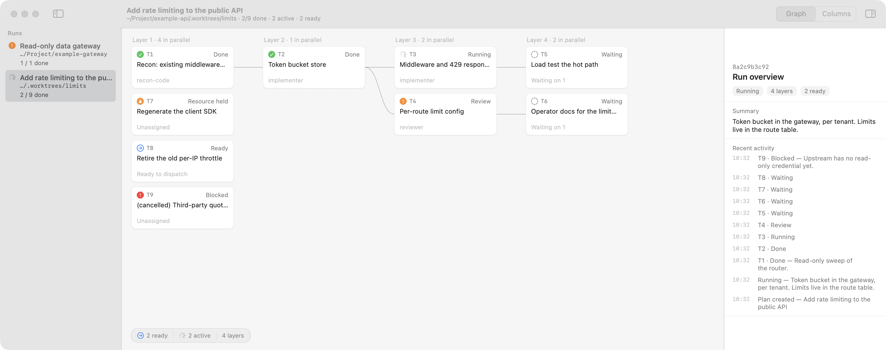
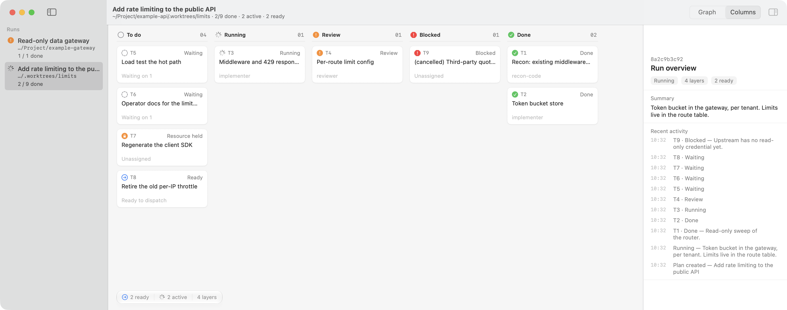
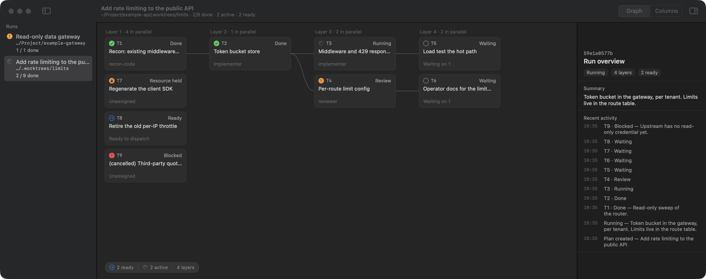

# boss-sdd

Two things that ship together:

- **A local board.** A menu bar macOS app (Swift 6, SwiftPM) that keeps a task
  DAG in SQLite and serves it over loopback HTTP, plus a Go MCP server that
  fronts that HTTP so an agent can read and write the board as structured JSON.
- **The `plan-sdd` skill.** A portable agent skill that orchestrates a multi-step
  change: recon, plan, build the DAG node by node with separate implementer and
  reviewer subagents, then close the branch out. It is packaged three ways, for
  Claude Code, Codex and Cursor, and it runs with or without the board.

It is for someone who wants an agent to carry a several-step change through to a
reviewed finish, and wants to watch the state of that while it happens.

Apple silicon Macs only. `Scripts/bundle.sh` cross-compiles the MCP binary for
`darwin/arm64` and nothing else, and the app targets macOS 14 or later.

## What the board looks like

This is the window `plan-sdd` reports into, seeded here with a synthetic run so
the screenshots hold no real project names or paths. Tasks lay out by
topological layer, so the graph view shows what could run in parallel next to
what already has, what is blocked, and what is holding an exclusive resource:



The same run in the columns view, which groups the same tasks by status
instead of by dependency layer:



And in dark appearance, back on the graph view:



## Layout

| Directory | What is in it |
| --- | --- |
| `Sources/BoardKit` | Models, DAG projection, SQLite storage, the HTTP API. No third-party dependencies. |
| `Sources/BossSDD` | The SwiftUI app: menu bar item plus the board window. |
| `mcp` | The Go MCP server. stdio transport, forwards to the app's local HTTP. |
| `skills` | The `plan-sdd` skill: a shared body plus one wrapper per platform. |
| `skills/shared` | `PLAYBOOK.md`, `roles.md` and the reference files. Platform-neutral. |
| `skills/claude-code`, `skills/codex`, `skills/cursor` | The three packagings. Each holds a `SKILL.md`, nine role definitions, and its own install document. |
| `design` | An HTML mock of the board window. |
| `docs/plans` | Plan documents. `2026-09-18-boss-sdd-hardening.md` holds the verified platform-facts table the skill packagings cite. |
| `Tests/BoardKitTests` | Graph parity against the old Python board, store guards, API, memory, legacy import. |

Data lives in `~/.claude/plan-sdd/board.sqlite3`. On first launch, if the store
has no runs and `~/.claude/plan-sdd/runs/` exists, the app imports the JSON files
the previous Python board wrote. It reads them and leaves them in place.

## Build and install

```bash
./Scripts/bundle.sh --install
```

That builds the Swift app in release, cross-compiles the Go MCP binary for
`darwin/arm64`, assembles `BossSDD.app` with an ad-hoc signature, then kills any
running `BossSDD` and replaces `/Applications/BossSDD.app`. Without `--install`
the bundle is left in `.build/BossSDD.app`.

The MCP binary ships inside the bundle, at
`BossSDD.app/Contents/Resources/plan-sdd-mcp`, so installing the app installs the
agent interface with it. The ad-hoc signature is enough for local use and for
`SMAppService` to register a login item; distribution would want a Developer ID
and notarisation.

## Registering the MCP server

For Claude Code:

```bash
claude mcp add --scope user plan-sdd /Applications/BossSDD.app/Contents/Resources/plan-sdd-mcp
```

For Codex and for Cursor, this repository does not ship a configuration block.
The platform facts the skill packagings were built against have no MCP row for
any of the three platforms, and a config block written here without having run it
would look exactly as convincing as a correct one. What the code does say is what
you would be registering: the binary above, no arguments, stdio transport, server
name `plan-sdd`. Get the syntax from your own installation's MCP documentation.
[`skills/codex/README.md`](skills/codex/README.md) step 4 and
[`skills/cursor/INSTALL.md`](skills/cursor/INSTALL.md) step 3 say the same thing
at more length.

## The MCP tools

Eleven tools, registered in `mcp/main.go`. Arguments are structured JSON, so
quotes, `$` and newlines inside a title or a detail need no escaping.

Board:

| Tool | What it does |
| --- | --- |
| `plan_board_status` | App state plus every run on this machine; starts the app if it is not running |
| `plan_create_run` | Create a run, returns its `run_id` |
| `plan_update_run` | Change the plan's overall status or its progress summary |
| `plan_set_task` | Create or update one task |
| `plan_set_tasks` | Write several tasks at once, applied in one transaction: if any one is rejected, none of them lands |
| `plan_graph` | Read-only graph projection |
| `plan_get_run` | Every task plus the projection, and optionally the recent activity |

Project memory:

| Tool | What it does |
| --- | --- |
| `plan_memory_list` | Every memory for a project, or only one `kind` of them |
| `plan_memory_get` | One memory, by `project` and `key` |
| `plan_memory_add` | Upsert on `(project, key)` |
| `plan_memory_delete` | Remove one, by `project` and `key` |

Every write returns the current graph projection alongside its result
(`valid`, `ready_task_ids`, `active`, `blocked`), so there is no separate
validation call to make afterwards.

## Project memory

The board also stores facts about a project that outlive a single run, so recon
does not rediscover them every time: gate commands, how to build and run the
thing, conventions, hard rules, exclusive resources. An entry has a `kind`, and
the kinds are `gate`, `run_recipe`, `convention`, `hard_rule`,
`exclusive_resource`, `note`.

`source` is required and cannot be blank. It names the file and line, or the
command output, the value was read from. A stored gate command that has since
changed is worse than no memory at all, because the agent runs the wrong gate and
reports green; `source` is what makes an entry cheap to falsify. `key` is trimmed
and lower-cased on the way in, and every tool returns the stored form.

The cap is 100 memories per project. At the cap a new key is refused with an
error naming the count, and nothing is evicted, because a `hard_rule` silently
dropped to make room is worse than one never stored. An upsert onto an existing
key still succeeds at the cap, so a wrong entry can always be corrected.

There is deliberately no search. A lookup that came back empty would otherwise
read as "nobody ever recorded that", when the fact was filed under a key you did
not think to try. `plan_memory_list` returns everything, and the cap is what
keeps that listing readable.

[`skills/shared/references/memory.md`](skills/shared/references/memory.md) is the
reference: how a run reads memory in phase 0, which kinds may be acted on before
a recon lane confirms them, and how to turn the whole thing off.

## The two write guards

The app refuses these two writes with an explicit error. The MCP layer does not
reimplement them, and there is no way around them:

1. Moving a task to `running` when its dependencies are not done.
2. Holding an `exclusive_resource` that a task already in `running` or `review`
   holds.

Overlapping `write_scope` and project-level concurrency are not the app's
business. The orchestrating agent still has to avoid those itself.

## Port and HTTP

The app listens on `127.0.0.1:18888`. `BOSS_SDD_PORT` overrides the port, which
is also how you run a second instance beside the first. When the port is taken,
the window toolbar says so rather than the app fighting for it.

Only the MCP server talks to that HTTP; agents do not call it directly. Three
things guard it, in `Sources/BoardKit/API.swift`:

- The `Host` header must be `127.0.0.1` or `localhost`.
- Any request carrying an `Origin` header is refused.
- `POST`, `PUT` and `PATCH` require `Content-Type: application/json`, which
  forces a CORS preflight that then fails, since no response here carries
  `Access-Control-Allow-*`.

Together those put the API out of reach of a web page running in a browser on the
same machine.

## Tests

One command checks the whole repository:

```bash
./Scripts/verify.sh
```

It runs four stages and stops at the first failure, so the exit code is the
whole answer and it drops straight into CI:

1. a release build of both halves;
2. `swift test`, then `go test ./...`;
3. `./Scripts/bundle.sh`, which assembles `.build/BossSDD.app`;
4. a live stage that boots the server and drives it over real HTTP.

The live stage is the part the unit suites cannot reach. It creates a run,
writes a DAG with a real dependency and checks the graph projection that comes
back, then confirms that starting a task whose dependency is unfinished is
refused with 409, that two tasks contending for one `exclusive_resource` are
refused too, and that a memory entry can be written, read back and deleted with
every answer naming the stored spelling of the key rather than the one that was
sent. It does not launch the SwiftUI shell, which cannot run headlessly and has
no way to be pointed away from the real database; it hosts the same compiled
BoardKit the app links, which is the half that answers HTTP.

The live stage needs `jq` and `curl` alongside the Swift and Go toolchains. It
listens on a port the OS hands out rather than 18888, so it does not disturb a
copy of the app you already have running, and it writes to a throwaway SQLite
file in a temporary directory, never to the board in `~/.claude/plan-sdd/`. It
reads that board file's timestamp before and after and fails if it moved.
Nothing survives the run: the server is stopped and the temporary directory
removed whether the script passed, failed, or was interrupted.

The gates also still run on their own:

```bash
swift test
cd mcp && go test ./...
```

`swift test` covers the graph parity suite, the store guards, the HTTP API,
memory, and the legacy import. The parity suite needs the old runs to compare
against: point `BOARD_PARITY_DIR` at a directory holding the legacy run JSON
files plus a `py_graphs.json` mapping run id to the Python `derive_graph` output.
Unset, that test returns without asserting anything.

## Installing the skill

Install **exactly one packaging per project.** All three define the same skill.
Cursor reads the other two platforms' skill and subagent directories as well as
its own, and same-name skills have no published precedence, so two packagings in
one repository means two copies of the same instructions reaching the agent with
nothing documenting which one answers.

**You have to set the per-role models yourself.** The roster ships a default tier
per role, and [`skills/shared/roles.md`](skills/shared/roles.md) argues each
placement so you can move one deliberately. But which rung you can actually
select depends on your own subscription and budget, and model names move. Where
to change them:

- Claude Code: the `model` key in each `.claude/agents/<role>.md`.
- Codex: the TOML layer under `skills/codex/agents/`, which the role's
  `config_file` points at. The declaration itself takes only `config_file` and
  `description`.
- Cursor: the `model` key in each `.cursor/agents/<role>.md`.

**Only the Claude Code packaging has been run.** The Codex and Cursor packagings
were written from those platforms' published documentation, read on 2026-09-18
and recorded in `docs/plans/2026-09-18-boss-sdd-hardening.md`. Nobody on this
project has either tool installed, so nothing in those two packagings has ever
been executed against a real installation. Both install documents mark the gaps
where their source was silent. Check them against your own installation before
trusting them.

### Claude Code

The skill goes in `~/.claude/skills/plan-sdd/`, the nine role files go in the
target project's `.claude/agents/`, and the board is an optional fourth step.
Invocation is `/plan-sdd`. Steps, the reasons `cp -RL` and `rm -rf` are both
load-bearing, and four post-install checks:
[`skills/claude-code/INSTALL.md`](skills/claude-code/INSTALL.md).

### Codex

The skill goes under `.agents/skills/plan-sdd/`, either in your home directory or
in a project, and the nine roles are declared in `config.toml` with a TOML layer
each. Steps, the `<SKILL_DIR>` substitution, the three checks that catch a bad
substitution before a run does, and the index of eight things the documentation
did not cover: [`skills/codex/README.md`](skills/codex/README.md).

### Cursor

The skill goes in `.cursor/skills/plan-sdd/` and the nine roles in
`.cursor/agents/`, with `.cursor/BUGBOT.md` as an optional fourth step for the
native reviewer. Steps, the guard that makes the `rm -rf` safe to paste, and a
duplicate-install check to run before and after:
[`skills/cursor/INSTALL.md`](skills/cursor/INSTALL.md).

### What the skill does

Four phases. Phase 0 sends three read-only recon subagents out in parallel to
establish the project's hard rules and gate commands, the product boundary, and
where the code lives. Phase 1 turns that into a written spec and a declarative
task DAG. Phase 2 walks the DAG: each ready node gets an implementer, then an
independent reviewer, then a bounded fix loop, then the gates, which the
orchestrator runs itself rather than delegating. Phase 3 reviews the whole branch
and hands back a delivery report.

The board is an observability layer, not the scheduler. Where the `plan_*` tools
are absent the skill computes the same ready set from the same declared fields
and keeps its state in the plan document instead.
[`skills/shared/PLAYBOOK.md`](skills/shared/PLAYBOOK.md) is the body; each
packaging's `SKILL.md` is the entry point that names it.
