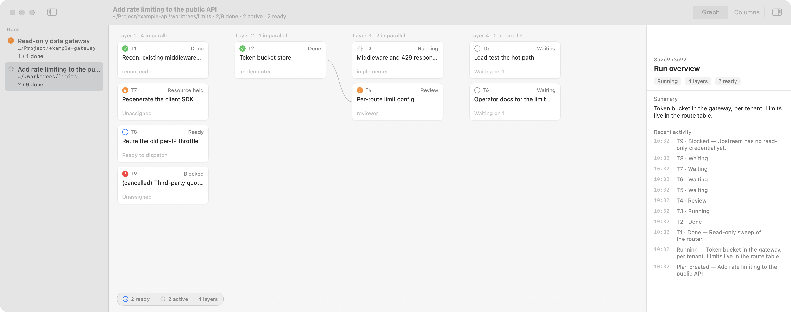
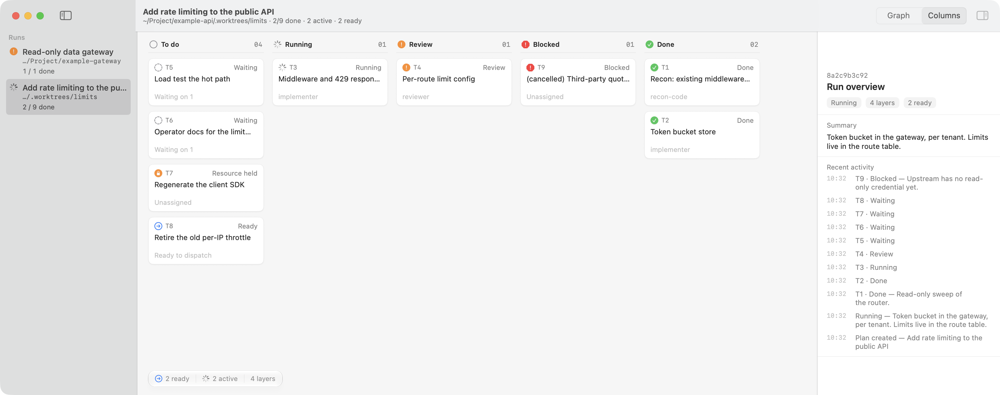

# boss-sdd

[English](README.md) | 中文

用 agent 把一个跨好几步的改动做完：先摸清项目，写出带依赖关系的任务图（DAG），然后按依赖顺序给每个节点派独立的实现者和审查者，最后整体复查、交付。本仓库包含：

- **`plan-sdd` skill**，两份完全独立，互不引用，各自装各自的：
  - `skills/claude-code/`：给 Claude Code 用。todo 和无人值守用 Claude Code 自带的任务列表和 `/goal`。
  - `skills/opencode/`：给 OpenCode 2.x 用。todo 和无人值守靠下面的插件。

  两份的流程是同一套：先跟用户讨论（Phase P），再 recon、写 spec 和 DAG；每个节点在自己的 worktree 里先写红测试、审红测试、再修；gate 先跑，绿了才审查；同一个原因修两次不好才升级一次模型。角色数量和平台细节不同：Claude Code 版 10 个角色，OpenCode 版 5 个。
- **六个 OpenCode 插件**（`plugins/`），Claude Code 都用不着：
  - `context-keeper`：上下文管理。解决长会话 compact 之后丢失项目信息、skill 规则、worktree 进度的问题。
  - `pin`：`pin_context` 工具。agent 把长期有用的事实（worktree、部署目标、决定）钉住，不再成立时自己删掉。
  - `goal`：无人值守目标。会话停下来时自动发一句"继续"，直到目标完成或者需要人。
  - `todo`：`todowrite` / `todoread` 工具。编排 agent 把正在跑的 task 写进去。
  - `plan-memory`：在 skill 规定的时间点，提醒读、写、整理看板里的项目记忆。
  - `sidebar`：TUI 侧边栏，显示上下文用量、goal、todo、正在跑的子 agent、git 状态。
- **看板**：一个 macOS 菜单栏 app（Swift），把任务图存进 SQLite；再加一个 Go 写的 MCP server，agent 通过它读写看板和项目记忆。两套包装都能接，不接也能跑。
- **两个辅助 skill**：`skills/shuorenhua/`（中文去 AI 味改写，Phase P 跟用户说话时用）和 `skills/prompt-engineer/`（派活前检查派活指令）。两个版本都会用，没装也能跑。

## 为什么 Claude Code 只要一个 skill，OpenCode 还要一个插件

Claude Code 在 compact 之后会把工作集重新挂回来：摘要里保留所有用户消息，最近读过的文件全文、调用过的 skill 全文、CLAUDE.md / AGENTS.md / 记忆文件都会重新附上。所以在 Claude Code 上，plan-sdd 一个 skill 就够了。

OpenCode 2.0.23 不这样做。干活过程中学到的东西（开头读到的 dev 服务器连接方式、部署信息、哪个 worktree 做到哪了、加载过的 skill 正文）只存在对话历史里。compact 是一次有损的单向改写：

- 摘要提示词明确要求省略环境细节；
- 已加载的 skill 正文不会重新附上；
- 会话一长，compact 就会发生好几次，每次都再丢一点。

最容易丢的两类：开头通过工具读到、后面再没提起的事实，和 skill 里的规则。会话一跑好几天、上下文约 256K 时，这个问题会反复出现。

## context-keeper 做了什么

`plugins/context-keeper/context-keeper.js`，OpenCode 2.x 插件（plugin API v2）。它做五件事，**全程不改 system prompt，也不按请求改工具列表**，所以不破坏 prompt cache：

1. **compact 之后重建工作集。** compact 后的第一条消息上附一个 `<restored-context>` 块，每个 compact 周期只算一次，之后逐字节重放（对缓存友好）。块里有：
   - 用户自己说过的话（原文）；
   - git / worktree 状态；
   - 当前 plan 文档的状态头和任务列表（直接读磁盘上的文件）；
   - 加载过的 skill 全文；
   - 子 agent 台账（最近 40 个）；
   - 最近读过的文件的当前内容；
   - `.opencode/context/*.md` 和 `~/.config/opencode/context/*.md`。

   pin、goal、todo 不在这个块里：pin、goal、todo 三个插件各自在每次请求里附上自己的状态（见下文）。
2. **改进摘要。** 历史放得进摘要请求时，在请求末尾追加额外的摘要要求。这时摘要请求和对话前缀一致，仍然命中缓存。放不下时，分块摘要再合并（map-reduce），把成品交给 OpenCode，不丢历史。
3. **分批清理旧工具输出。** 只对编排 agent（默认 `build,plan,plan-sdd`）生效。上下文到预算的 25% / 50% / 75% / 90% 时，各清理一次：当前这一轮（最后一条用户消息）之前、能重新拿到的工具输出（读文件、命令输出）换成一行占位符，告诉模型怎么取回来；派给子 agent 的长 brief 也换成摘要占位符（子 agent 自己的会话里有全文）；`skill`、`pin_context`、`goal` 的输出不动。一轮特别长时，最多只保护这一轮的最后 10 条消息（90% 那次是 4 条）。同时发一条 `<context-budget>` 提醒，给出具体 token 数；装了 pin 插件时，提醒里还会让 agent pin 住还要用的事实、删掉不再成立的 pin。清理只在这几个时间点做，而且会逐字节重放，所以对缓存的影响局限在那一次。
4. **子 agent 模型守卫。** 编排者常按 Claude 的档位名（`haiku` / `sonnet` / `opus`）给子 agent 指定模型，OpenCode 不认这些名字，编排者就会随便猜一个"可用"的模型，整场运行随机失败。守卫的处理：
   - 能映射的按 `CONTEXT_KEEPER_MODEL_MAP` 改写；
   - OpenCode 认识的模型（比如 `model-policy.json` 解析出来的）原样保留；
   - 其余的删掉，回落到 agent 文件或编排者的模型。
5. **compaction 请求和主请求共用前缀。** compaction hook 里先重放清理结果、附上已有的恢复块，保证摘要请求也能命中缓存。

用量是对序列化后的整个请求做的估算（中日韩字符一个算 1 token，其他文本每 3.5 个字符算 1 token）。模型服务对 JSON 分词比较紧时会估高，一次 DeepSeek 实测高了 13%。所以每一步结束后，插件拿这次请求的估算值和模型服务报回的输入大小比一比，用这个比例的滑动平均（限制在 0.5 到 1.3 之间）去缩放后面的估算，让分批清理的档位和预算提醒跟着模型实际看到的量走。判断压缩要不要分块的那个大小检查不做缩放。

另外每次编排 agent 发请求时，它往状态文件里写一份 `meter`：估算用量、窗口、已触发的清理档位、清掉了多少条输出。sidebar 读这个显示。

## pin、goal、todo、plan-memory、sidebar

pin、goal、todo 三个插件各自在每次请求的最后附一小块自己的状态：`<pins>`、`<goal>`、`<todos>`。这块只在发请求时临时附上，不写进历史，所以压缩和分批清理都丢不掉它，也不用恢复，对话前缀的缓存不受影响。提醒和清理也由各插件自己负责。

**pin**（`plugins/pin/pin.js`）。`pin_context` 用来新增、更新、删除 pin，一次调用可以改好几个（`remove: [键]`）。`<pins>` 块列出每个 pin 和它的时间，并要求 agent 删掉或改掉不再成立的。pin 不按时间过期，工具说明里写了什么时候该删：决定被推翻、值改了、worktree 已合并、任务做完、评审问题已修。最多 30 个，每个最长 500 字符，满了要先删掉一些才能加新的。用旧版 context-keeper pin 过的会话，pin 会被接过来。

**goal**（`plugins/goal/goal.js`）。用户说"跑完再叫我"时，模型调 `goal set` 定目标。之后会话每次停下，插件等 5 秒，发一条 `<goal-continue>` 让它接着做。下面这些情况不再续：
- 模型调了 `goal wait`（需要用户给凭据、批准、做产品决定）或 `goal complete`（要附证据）；
- 用户中断，或者这一轮出错（比如额度用完）；
- 连续两次自动续，模型一个工具都没调；
- 续了 200 次。

还有后台子 agent 在跑时，等 30 分钟再续，因为子 agent 跑完 OpenCode 会自己唤醒会话。用户发新消息，waiting 的 goal 会变回 active。goal 没完成之前，每次请求都带一个 `<goal>` 块，写着目标和当前状态。

**todo**（`plugins/todo/`）。`todowrite` 每次传整份列表，`todoread` 读回来，按会话存在 `~/.config/opencode/state/todos/`。plan-sdd 的规则是：DAG 确认后每个 task 一项；派出去就标 `in_progress`，并行的一批可以同时有几项；`done` 了标 `completed`；和 plan 文档对不上时以 plan 为准。每次请求都带一个 `<todos>` 块，列出没完成的项；如果在最后一次 `todowrite` 之后又派了子 agent，块里会写明派了几个，并提醒更新列表。

**plan-memory**（`plugins/plan-memory/plan-memory.js`）。skill 里已经写了什么时候读、写、整理看板的项目记忆；但从实验记录看，编排者几乎每次都会读，却几乎从不把 recon 核实过的事实存进去，也从没整理过。这个插件盯着看板调用，只在该提醒的时候附一个 `<memory>` 块：
- 读：有正在进行的 run，而上一个 run 结束以后还没调过 `plan_memory_list`；
- 写：派过 recon、任务图也写好了，但一条 `plan_memory_add` 都没有（只提醒 3 次，因为 recon 也可能没查到新东西）；
- 整理：上次读 memory 之后，累计 5 个任务变成 `done`/`blocked`，或者 run 进入 `review`（收尾）。

它只负责提醒，读什么、写什么、删什么还是按 skill 来。

**sidebar**（`plugins/sidebar/`）。替换 OpenCode 自带的 Context 区块（那个只有 token 数、百分比、花费三行）。用 mock 数据渲染出来是这样（36 列宽）：

```
▼ Context 58%
█████████████████░░░░░░░░░░┃░░
152K / 262K tokens         cache 93%
Next clearing at 75% (197K)
┃ auto-compact at 236K
Compacted 2× · 5 pins
Cleared 18 old outputs (96K chars)

▼ Goal active · 3 continues
Finish plan docs/plans/storage.md:
T1-T6, gates green, branch ready to
merge
1 background subagent still running

▼ Todo 1/4
☑ T1 parser
▶ T2 storage layer (implementer)
▶ T3 api
☐ T4 review + gates

▼ Subagents 1 running
▼ Git refresh
plan/t2-storage · base main
1 changed file +40 −3
```

- 进度条按百分比变色（60% 以下绿，80% 以下黄，再往上红）；`┃` 是 OpenCode 自动 compact 的位置：窗口减去 max(10%, 16K)，256K 窗口约在 90%。
- token 数和缓存命中率取最后一次请求里提供商返回的真实值；还没有真实值时用 context-keeper 的估算，前面加 `≈`。
- 压缩次数直接数会话里的 compaction 消息；"Next clearing" 和 "Cleared" 来自 context-keeper 的 meter。
- 每一块都能点标题折叠；Git 里点文件会用 Otty 预览（没装 Otty 会弹提示）。

### 配置

都是可选的环境变量，设在启动 OpenCode 服务的环境里：

| 变量 | 默认 | 作用 |
| --- | --- | --- |
| `CONTEXT_KEEPER_PRIMARY` | `build,plan,plan-sdd` | 哪些 agent 算编排者（只对它们做清理和预算提醒） |
| `CONTEXT_KEEPER_WINDOW` | 从模型列表取，取不到用 200000 | 上下文窗口大小，比如 `262144` |
| `CONTEXT_KEEPER_MODEL_MAP` | 空 | `haiku=prov/model,opus=prov/model#variant` |
| `CONTEXT_KEEPER_SUBAGENT_MODELS` | 空 | 额外放行的模型，`prov/model` 或 `prov/*` |
| `CONTEXT_KEEPER_MODEL_GUARD` | `on` | 设成 `off` 关掉模型守卫 |
| `CONTEXT_KEEPER_IDLE_MS` | `3600000` | 空闲超过这么久，认为提供商的缓存已经冷了，清理可以顺便做 |
| `CONTEXT_KEEPER_LOG` | 空 | 设成文件路径时，日志另外追加到这个文件 |
| `OPENCODE_GOAL_DELAY_MS` | `5000` | 一轮结束后等多久再发"继续" |
| `OPENCODE_GOAL_MAX_CONTINUES` | `200` | 最多自动续几次 |
| `OPENCODE_GOAL_CHILD_WAIT_MS` | `1800000` | 有后台子 agent 在跑时等多久再续 |
| `OPENCODE_GOAL_LOG` | 空 | goal 插件的日志文件 |
| `OPENCODE_TODO_DIR` | `~/.config/opencode/state/todos` | todo 列表存放目录（todo、context-keeper、sidebar 三个插件都读它） |

状态文件在 `$XDG_STATE_HOME/opencode-context-keeper/` 和 `$XDG_STATE_HOME/opencode-goal/`（默认在 `~/.local/state/` 下），每个会话一个 JSON。

### 提示词的自我进化

思路来自 Context Language Models 论文（只借思路，没用它的提示词和代码）：用回忆题做评测集，让模型改写提示词，分数涨了才保留。

**每段提示词分两部分。** 可进化的提示词一共五段：context-keeper 里四段（压缩时追加的摘要要求、分块摘要、合并、预算提醒），pin 插件里一段（`pin_context` 说明）。两个插件读同一个 `evolved.json`。每段都由两部分组成：

- **固定部分**写在代码里，是硬规则，进化碰不到。比如路径和命令原样保留、绝不 pin 密钥、摘要章节结构、用用户的语言写。
- **可进化部分**是追加在后面的一段指引，从 `~/.config/opencode/context-keeper/evolved.json` 读（环境变量 `CONTEXT_KEEPER_EVOLVED` 可以改路径）。每段有长度上限：摘要要求 800 字符，分块和合并各 500，预算提醒 500，pin 说明 300。超长、不是字符串、或者含 `<` 的槽位会被忽略，只用固定部分。文件不存在时，插件行为和没有这个功能时完全一样。

**评测：离线回放真实的压缩**（`plugins/context-keeper/evolve/`）。
- 从 opencode 数据库里取出每次压缩前的历史，用 opencode 2.0.23 原版的压缩提示词，加上固定的摘要要求和候选指引，重新生成一次摘要。
- 打分只看事实保住了没有：标准答案原样出现在新摘要里才算。不让模型答题，所以一个候选在一个压缩点上只花一次请求。
- 题目只考通过工具读到的事实。AGENTS.md 里的内容随系统提示一直都在，考不出东西。
- 值中途变过的（比如跳板端口），以历史里最后出现的写法为准。

**防过拟合。**
- 写候选的模型看不到答案，只看到丢分的是哪一类事实，比如“早期从文档读到的连接步骤”。
- 候选里只要出现题库中任何一个具体值（主机、端口、工单号、路径），就直接作废，不打分。
- 每个分数都是跑 `--samples` 次（默认 2 次）取平均。训练集要比当前文本至少多保住 `--margin` 个事实（默认 1 个），保留集不能降，两条都满足才采纳。保留集是整场会话留出来的。
- 结果写到 `evolve/runs/<时间戳>/evolved.json`，不会自动装上，要手动拷过去。

```bash
cd plugins/context-keeper/evolve
node --no-warnings evolve.mjs items      # 列出压缩点和每个点能考的题
node --no-warnings evolve.mjs stored     # 给当时存下的摘要打分，不调用模型
node --no-warnings evolve.mjs evolve --model kimi-code-plan-cn/k3 --rounds 3 --items <id,id,...>
```

模型通过本机 opencode 服务的无状态生成接口调用。OpenCode 的免费模型不让走这个接口，要加 `--via run` 改走 `opencode run`。这样会带上 build agent 的系统提示和工具，只适合跑通流程。

### 基线

在合成项目上离线回放压缩，模型 DeepSeek V4.1 Flash，不加进化文本。

**摘要。** 用 opencode 原版压缩提示词、不加 keeper 的任何要求，6 个会话 25 个压缩点一共保住 271/275 个事实。丢的 4 个都是后来被推翻的决定，其中一部分只是写法不同。在这个水平的模型上，摘要这一段可进化的空间很小。真正会丢的是结构性问题（skill 正文不重新挂回来、历史放不下时被截断），这些由恢复块解决。

**pin。** 在每个压缩点，把到那时的对话和预算提醒给模型，让它写出要 pin 的内容；分数是后面要考的事实有多少在 pin 里。76 个点跑了 67 个：463/574 个事实（80.7%），训练集 330/424，保留集 133/150。

| 来源 | 压缩点 | pin 住的事实 |
| --- | --- | --- |
| orders、inventory 项目 | 16 | 165/176（93.8%） |
| 中文长会话 | 30 | 258/317（81.4%） |
| 早期实验会话 | 21 | 40/81（49.4%） |

后面要用的事实大约五个里有一个没被 pin，所以值得进化的是 pin 和预算提醒这两段。

### 看 compact 的情况

```bash
python3 -I plugins/context-keeper/compaction-audit.py --last 30
```

只读 `~/.local/share/opencode/opencode.db`。每次 compact 打印：compact 前的上下文大小、摘要请求实际看到的大小、两者之比、摘要长度、摘要里中文的比例。

## 效果

在 OpenCode 2.0.23 上测，用的是合成项目（一个 Node 写的 invoice-cli，带部署文档、plan-sdd 的 AGENTS.md 和 10 个角色）。

### 回忆测试：compact 之后还记得多少

做法：多轮对话，中间触发多次 compact，最后要求"不许调用任何工具，只凭现有上下文回答，不知道写 UNKNOWN"。

| 实验 | 模型 | 基线 | 装了 keeper | 基线丢了什么 |
| --- | --- | --- | --- | --- |
| 中文长会话，开头读 dev 访问文档，之后排查 14 个日志文件 | mimo-v2.6-flash（免费） | 5/6 | 6/6 | `DEV_MARK` |
| 同上，中途改了跳板端口、任务状态和负责人 | mimo-v2.6-flash（免费） | 7/8 | 8/8 | `DEV_MARK` |
| plan-sdd 项目，第 2 轮后提问 | kimi-for-coding-highspeed | 5/6 | 6/6 | skill 里的 gate 失败规则（答 UNKNOWN） |

第二行两组都答出了中途改过以后的端口。

### compact 之后的上下文里有没有关键信息

统计 compact 之后每个请求里是否出现：部署标记、部署主机、plan 的 run id、恢复块。

| 模型 | 组 | 部署标记 | 部署主机 | run id | 恢复块 |
| --- | --- | --- | --- | --- | --- |
| mimo-v2.6-flash | 基线 | 0% | 0% | 0% | 0% |
| mimo-v2.6-flash | keeper | 100% | 100% | 100% | 100% |
| fledge-alpha | 基线 | 0% | 0% | 0% | 0% |
| fledge-alpha | keeper | 100% | 100% | 100% | 100% |
| kimi | 基线 | 75% | 75% | 98% | 0% |
| kimi | keeper¹ | 0% | 0% | 100% | 100% |

¹ 这组第 1 轮后就停了，compact 之前可能还没读部署文档（未核实）。

### prompt cache 命中率

| 模型 | 组 | 主会话 | compaction 请求 |
| --- | --- | --- | --- |
| mimo | 基线 / keeper | 85.6% / 87.5% | 89.9% / 99.2% |
| fledge | 基线 / keeper | 92.6% / 96.4% | 98.8% / 97.9% |
| kimi | 基线 / keeper（第 1 组） | 96.7% / 96.2% | 99.1%、99.1% / 96.6% |
| kimi | 基线 / keeper（第 2 组） | 95.7% / 96.3% | 98.2%、97.8% / 96.8% |

### 分批清理

同一段 20 轮的脚本会话（读大日志文件，最后几轮重读一部分），Kimi k3，窗口限制在 64K。三组都装了 keeper，只有清理方式不同。

| 清理 | 模型调用 | 压缩次数 | 缓存命中 | 读文件 | pin_context 次数 |
| --- | --- | --- | --- | --- | --- |
| 关 | 51 | 2 | 91.5% | 29 | 0 |
| 保护最近 10 条消息（旧规则） | 66 | 2 | 89.0% | 36 | 8 |
| 只保护当前这一轮（现在的规则） | 72 | 1 | 93.2% | 28 | 18 |

保护最近 10 条时能清的太少，模型还会把清掉的文件重新读一遍。只保护当前这一轮，压缩次数减半，也没有多读。两个清理组多出来的调用是预算提醒触发的 `pin_context`。每行只跑了一次。

## OpenCode 注意事项

- OpenCode 按路径缓存插件模块，更新插件文件后要 `opencode service restart`。
- 访问项目目录以外的路径要 `external_directory` 授权。`opencode run --auto` 只在客户端活着时替你批准，无人值守时后台子 agent 可能卡在授权上。agent 文件里放行了 `*-worktrees/*`（`*` 也能匹配 `/`）；内置 agent 要靠安装第 4 步的全局规则。
- DeepSeek 在 code mode 下要通过 `execute` 调插件工具（`tools.pin_context(...)`）。
- agent 文件里的 `readonly: true` 在 OpenCode 2.0.23 里不起作用，要在 `permission:` 下写 `edit: deny`。没写 `mode: subagent` 的 agent 会被当成 primary。

## 安装

### Claude Code

按 [`skills/claude-code/INSTALL.md`](skills/claude-code/INSTALL.md) 做。要点：

```bash
rm -rf ~/.claude/skills/plan-sdd
mkdir -p ~/.claude/skills/plan-sdd
cp -R skills/claude-code/. ~/.claude/skills/plan-sdd/
cp -R skills/shuorenhua skills/prompt-engineer ~/.claude/skills/
```

10 个角色文件拷到目标项目的 `.claude/agents/`。旧版装过 `spec-reviewer.md` 的要删掉，它改名成了 `spec-auditor.md`。每个用途用哪个模型，写在 `skills/claude-code/roles.md` 的 "Model bindings" 表里；额度不够时不会自动换模型。看板是可选的第 4 步。

无人值守：skill 不能自己开 `/goal`，它会给你一行 `/goal ...` 让你输入。不输入也能跑，但一轮结束就停，要你说话才继续。上面六个插件 Claude Code 都不需要。

### OpenCode

在仓库根目录执行。

1. skill、编排 agent 和 5 个角色：

   ```bash
   mkdir -p ~/.config/opencode/skills ~/.config/opencode/agents
   rm -rf ~/.config/opencode/skills/plan-sdd
   cp -R skills/opencode ~/.config/opencode/skills/plan-sdd
   cp skills/opencode/agents/*.md ~/.config/opencode/agents/
   ```

   `agents/plan-sdd.md` 是编排 agent（`mode: primary`），在 TUI 里切到它再开始。

2. 依赖的两个 skill：

   ```bash
   cp -R skills/shuorenhua skills/prompt-engineer ~/.config/opencode/skills/
   ```

3. 插件。六个互相独立，按需装；不装 pin 就没有 `pin_context`，不装 goal 就没有自动续跑，不装 todo 就没有 todo，sidebar 对应的区块不显示：

   ```bash
   mkdir -p ~/.config/opencode/plugins
   cp plugins/context-keeper/context-keeper.js plugins/pin/pin.js plugins/goal/goal.js plugins/plan-memory/plan-memory.js ~/.config/opencode/plugins/
   rm -rf ~/.config/opencode/plugins/todo ~/.config/opencode/plugins/sidebar
   mkdir -p ~/.config/opencode/plugins/todo ~/.config/opencode/plugins/sidebar
   cp plugins/todo/package.json plugins/todo/index.ts plugins/todo/store.ts ~/.config/opencode/plugins/todo/
   cp plugins/sidebar/package.json plugins/sidebar/index.ts plugins/sidebar/tui.tsx ~/.config/opencode/plugins/sidebar/
   opencode service restart
   ```

   关掉 OpenCode 自带的两个侧边栏区块：Context（和 sidebar 重复）和 MCP 列表。在 `~/.config/opencode/cli.json` 里加（文件不存在就新建）：

   ```json
   { "plugins": ["-opencode.sidebar.context", "-opencode.sidebar.mcp"] }
   ```

   `-` 开头的条目会禁用同名的内置插件。

4. 项目目录以外路径的授权。上面的 agent 文件已经放行了 worktree 和 `/tmp`，但 OpenCode 自带的 agent（比如编排者有时会派的 `explore`）不读这些文件，无人值守时会卡在授权确认上，整个 run 就停了。在 `~/.config/opencode/opencode.json` 里加同样的规则：

   ```json
   {
     "permission": {
       "external_directory": { "*-worktrees/*": "allow", "/tmp/*": "allow", "/private/tmp/*": "allow" }
     }
   }
   ```

5. 看板 MCP（可选）。先装看板 app（见下文），再在 `opencode.json` 里加：

   ```json
   {
     "mcp": {
       "plan-sdd": {
         "type": "local",
         "command": ["/Applications/BossSDD.app/Contents/Resources/plan-sdd-mcp"]
       }
     }
   }
   ```

6. 模型策略（可选）。从示例改：

   ```bash
   cp skills/opencode/references/model-policy.example.json ~/.config/opencode/model-policy.json
   ```

   每个用途（`implementer.default`、`reviewer.default` 等）对应一个具体模型，格式见 `skills/opencode/references/model-policy.md`。每次 run 开头读一次、校验一次。文件不存在时不指定模型，子 agent 用自己 agent 文件里的模型或编排者的模型。额度不够时不会自动换模型。

7. 检查：

   ```bash
   opencode debug agents
   ```

   确认 `recon`、`implementer`、`qa`、`reviewer`、`spec-auditor` 都在，`mode` 是 `subagent`。

## 看板

macOS 菜单栏 app（Swift 6、SwiftPM），用 SQLite 存任务图，在本机回环地址上提供 HTTP；Go 写的 MCP server 转发这个 HTTP，agent 通过它以结构化 JSON 读写看板。只支持 Apple silicon、macOS 14 及以上。



同一个 run 的分列视图，按状态分组：



### 构建和安装

```bash
./Scripts/bundle.sh --install
```

先 release 构建 Swift app，再交叉编译 `darwin/arm64` 的 MCP 二进制，打包成 `BossSDD.app`（ad-hoc 签名），替换 `/Applications/BossSDD.app`。MCP 二进制在 `BossSDD.app/Contents/Resources/plan-sdd-mcp`。不加 `--install` 就只留在 `.build/BossSDD.app`。

Claude Code 注册 MCP：

```bash
claude mcp add --scope user plan-sdd /Applications/BossSDD.app/Contents/Resources/plan-sdd-mcp
```

### MCP 工具

看板 9 个：`plan_board_status`、`plan_create_run`、`plan_update_run`、`plan_set_task`、`plan_set_tasks`（一个事务，一个失败全部不写）、`plan_graph`、`plan_get_run`、`plan_delete_run`（run 在 `running` 时拒绝）、`plan_delete_task`（任务在 `running` / `review`，或者被别的任务依赖时拒绝）。

项目记忆 4 个：`plan_memory_list`、`plan_memory_get`、`plan_memory_add`（按 `(project, key)` 覆盖写入）、`plan_memory_delete`。

除了删除 run，每次写入都会带回最新的图投影（`valid`、`ready_task_ids`、`active`、`blocked`），不需要另外校验。

### 项目记忆

存跨 run 仍然成立的项目事实：gate 命令、怎么跑起来、约定、硬规则、独占资源。`kind` 取 `gate`、`run_recipe`、`convention`、`hard_rule`、`exclusive_resource`、`note` 之一。

- `source` 必填，写明是从哪个文件哪一行、哪条命令输出读来的，这样过时的条目一查就能推翻。
- 每个项目最多 100 条；满了拒绝新 key，不自动淘汰，但仍能覆盖写入已有 key。
- 故意不提供搜索，`plan_memory_list` 返回全部。

### 写入保护

app 会拒绝两种任务写入：依赖没完成就把任务设成 `running`；占用一个已被 `running` 或 `review` 任务持有的 `exclusive_resource`。`write_scope` 重叠和项目自己的并发限制由编排 agent 负责。

### 端口和 HTTP

监听 `127.0.0.1:18888`，用 `BOSS_SDD_PORT` 改。只接受 `Host` 为 `127.0.0.1` 或 `localhost` 的请求，拒绝带 `Origin` 头的请求，`POST` / `PUT` / `PATCH` 必须是 `Content-Type: application/json`。这样同一台机器上浏览器里的网页访问不到它。

数据在 `~/.claude/plan-sdd/board.sqlite3`。

## 测试

```bash
./Scripts/verify.sh
```

分四步，第一步失败就停：release 构建；`swift test` 和 `go test ./...`；`./Scripts/bundle.sh`；起一个真实服务，通过 HTTP 跑一遍（建 run、写依赖、验证 409 拒绝、读写记忆）。这一步用系统分配的端口和临时 SQLite，不碰 `~/.claude/plan-sdd/` 里的看板。需要 `jq` 和 `curl`。

插件的测试：

```bash
sh plugins/context-keeper/test/run.sh
sh plugins/pin/test/run.sh
sh plugins/goal/test/run.sh
sh plugins/plan-memory/test/run.sh
(cd plugins/todo && bun test)
(cd plugins/sidebar && bun install && bun test)
```

context-keeper、pin、goal 和 plan-memory 用 node 跑，状态写到临时目录，不碰 `~/.local/state`。sidebar 的测试用 mock 数据把侧边栏渲染成文本，需要先 `bun install` 装开发依赖。

## 目录

| 目录 | 内容 |
| --- | --- |
| `skills/claude-code/` | Claude Code 版：`SKILL.md`（平台绑定）、`PLAYBOOK.md`（流程）、`roles.md`、10 个角色、references、`INSTALL.md` |
| `skills/opencode/` | OpenCode 版：`SKILL.md`、`ADAPT.md`、5 个角色、references |
| `skills/shuorenhua/`、`skills/prompt-engineer/` | 两个版本都会用的辅助 skill |
| `plugins/context-keeper/` | 上下文管理插件、compact 审计脚本、测试 |
| `plugins/pin/` | `pin_context` 插件和测试 |
| `plugins/goal/` | 无人值守目标插件和测试 |
| `plugins/plan-memory/` | 项目记忆提醒插件和测试 |
| `plugins/todo/` | todo 工具插件和测试 |
| `plugins/sidebar/` | TUI 侧边栏插件和渲染测试 |
| `Sources/BoardKit` | 数据模型、DAG 投影、SQLite 存储、HTTP API，无第三方依赖 |
| `Sources/BossSDD` | SwiftUI app：菜单栏和看板窗口 |
| `mcp/` | Go MCP server，stdio，转发到 app 的本地 HTTP |
| `Tests/BoardKitTests` | 图计算、存储保护、API、记忆、旧数据导入 |
| `docs/plans/` | 本仓库自己的 plan 文档 |

## 待办

还没做的事和已知问题记在 [GitHub issues](https://github.com/zcl0621/boss-sdd/issues) 里。
